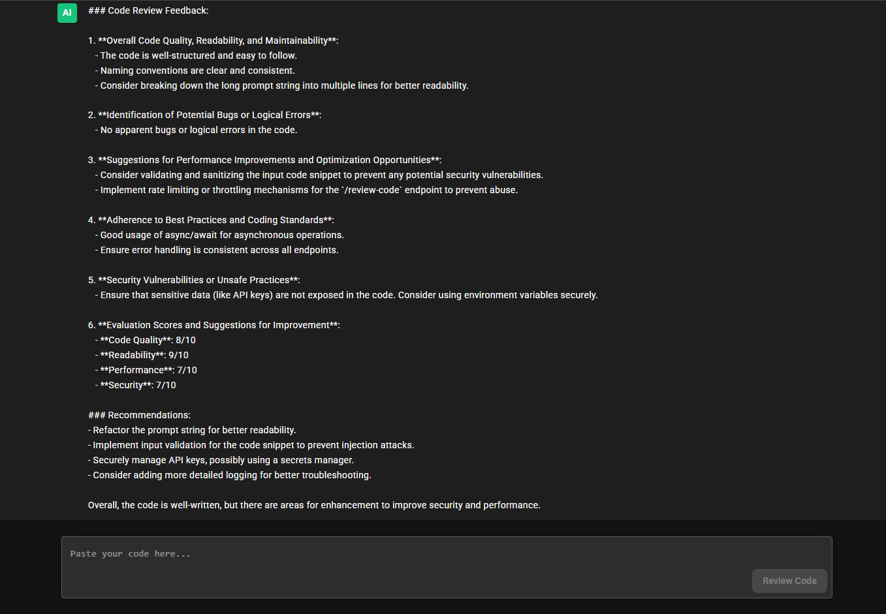

# AI Code Reviewer

An AI-powered code review application that provides instant feedback on your code using OpenAI's GPT-3.5 model. The application features a modern, ChatGPT-like interface for submitting code and receiving detailed reviews.


*Screenshot: AI Code Reviewer providing detailed feedback with code quality scores and recommendations*

## Table of Contents
- [Features](#features)
- [Tech Stack](#tech-stack)
- [Detailed Implementation](#detailed-implementation)
- [Prerequisites](#prerequisites)
- [Setup Instructions](#setup-instructions)
- [API Documentation](#api-documentation)
- [Project Structure](#project-structure)
- [AI Agent Capabilities](#ai-agent-capabilities)
- [Contributing](#contributing)
- [Troubleshooting](#troubleshooting)
- [Best Practices](#best-practices)

## Features

- 🤖 AI-powered code analysis
  - Real-time code quality assessment
  - Detailed feedback on potential improvements
  - Security vulnerability detection
  - Performance optimization suggestions
  - Best practices recommendations

- 💻 Modern, responsive UI
  - ChatGPT-like interface
  - Dark mode by default
  - Syntax highlighting for code
  - Responsive design for all screen sizes
  - Smooth animations and transitions

- 🔍 Comprehensive code review feedback
  - Code quality scoring
  - Readability assessment
  - Performance metrics
  - Security analysis
  - Best practices evaluation

- ⚡ Real-time responses
  - Instant feedback
  - Progress indicators
  - Error handling
  - Retry mechanisms

- 🎨 Dark mode interface
  - Eye-friendly design
  - Custom scrollbars
  - Modern Material UI components
  - Consistent theming

- 💬 Chat-like conversation history
  - Persistent review history
  - Contextual responses
  - Clear user/AI distinction
  - Markdown support

## Detailed Implementation

### Backend Architecture

#### Server Setup
- Express.js server with middleware configuration
- CORS enabled for frontend communication
- Environment variable management with dotenv
- Error handling middleware
- Health check endpoint

#### OpenAI Integration
- GPT-3.5 Turbo model implementation
- Prompt engineering for code review
- Error handling and retry logic
- Rate limiting implementation
- Response parsing and formatting

#### Security Measures
- Input sanitization
- API key protection
- Rate limiting
- Error handling
- Request validation

### Frontend Architecture

#### React Components
- App.js: Main application component
- MessageBubble: Chat message component
- Custom hooks for state management
- Theme provider implementation
- Responsive design components

#### State Management
- React hooks for local state
- Conversation history management
- Loading states
- Error handling states
- Form state management

#### UI/UX Features
- Real-time feedback
- Loading indicators
- Error messages
- Syntax highlighting
- Responsive design
- Custom scrolling
- Smooth animations

## API Documentation

### Health Check Endpoint
```http
GET /
```
#### Response
```json
{
    "status": "success",
    "message": "Server is running",
    "timestamp": "2024-02-07T10:00:00.000Z",
    "uptime": 123.45
}
```

### Code Review Endpoint
```http
POST /review-code
```
#### Request Body
```json
{
    "code": "string (required) - The code snippet to review"
}
```
#### Response
```json
{
    "feedback": {
        "overall_quality": "Detailed analysis of code quality",
        "potential_bugs": "List of potential issues",
        "performance_suggestions": "Performance improvement tips",
        "best_practices": "Coding standards feedback",
        "security_concerns": "Security vulnerability analysis",
        "scores": {
            "code_quality": "8/10",
            "readability": "9/10",
            "performance": "7/10",
            "security": "7/10"
        }
    }
}
```

## AI Agent Capabilities

### Code Analysis
- Syntax error detection
- Logic flow analysis
- Performance bottleneck identification
- Security vulnerability scanning
- Best practices evaluation

### Feedback Generation
- Detailed explanations
- Specific code examples
- Actionable recommendations
- Performance optimization tips
- Security improvement suggestions

### Review Categories
1. **Code Quality Assessment**
   - Structure analysis
   - Naming conventions
   - Code organization
   - Documentation quality

2. **Bug Detection**
   - Syntax errors
   - Logical errors
   - Edge cases
   - Potential runtime issues

3. **Performance Analysis**
   - Algorithm efficiency
   - Resource usage
   - Optimization opportunities
   - Bottleneck identification

4. **Security Evaluation**
   - Vulnerability detection
   - Security best practices
   - Input validation
   - Data protection

5. **Best Practices**
   - Industry standards
   - Design patterns
   - Code maintainability
   - Documentation requirements

## Troubleshooting

### Common Issues

1. **OpenAI API Issues**
   - Check API key validity
   - Verify rate limits
   - Check request format
   - Monitor API status

2. **Server Connection**
   - Verify server is running
   - Check port availability
   - Confirm CORS settings
   - Review network logs

3. **Frontend Issues**
   - Clear browser cache
   - Check console errors
   - Verify API endpoint
   - Review React dev tools

## Best Practices

### Code Submission
- Submit complete code snippets
- Include necessary context
- Format code properly
- Keep snippets focused

### Security
- Never share API keys
- Use environment variables
- Implement rate limiting
- Validate all inputs
- Sanitize code snippets

### Development
- Follow coding standards
- Write clear documentation
- Use meaningful commit messages
- Test thoroughly
- Keep dependencies updated

## Note

Remember to:
- Never commit your `.env` file or expose your OpenAI API key
- Keep your dependencies updated
- Follow the existing code style and conventions
- Regularly update the OpenAI API version
- Monitor API usage and costs
- Backup your configuration
- Test the application thoroughly before deployment
